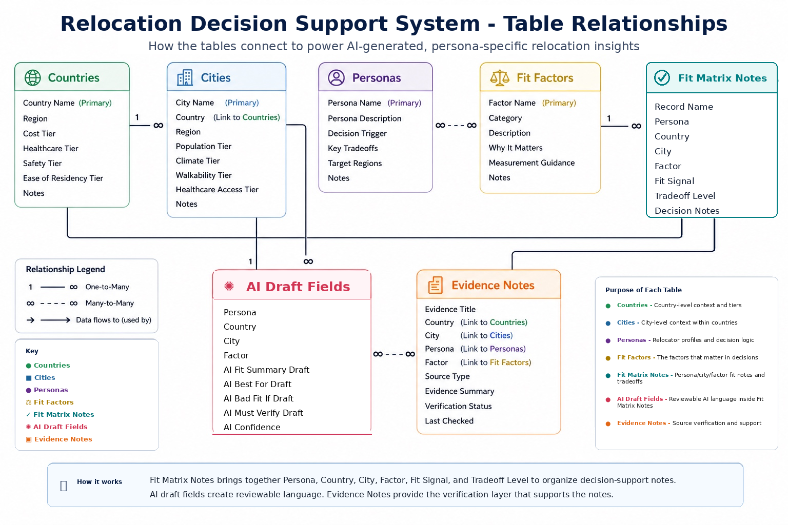
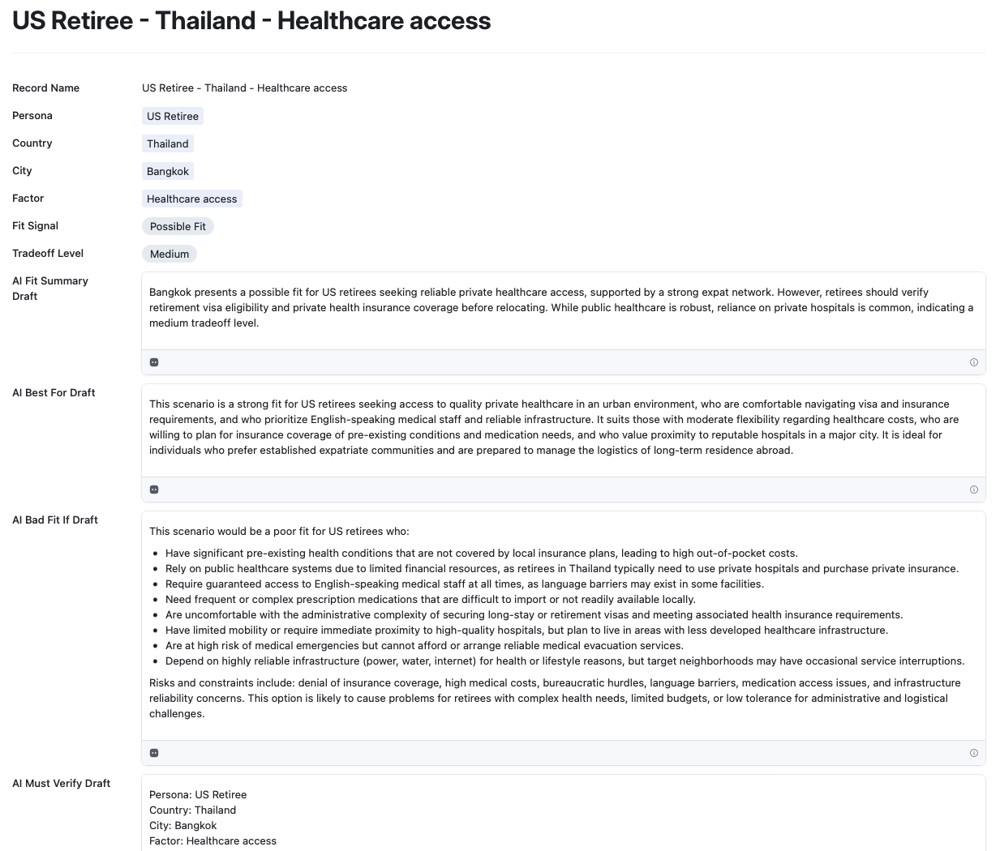
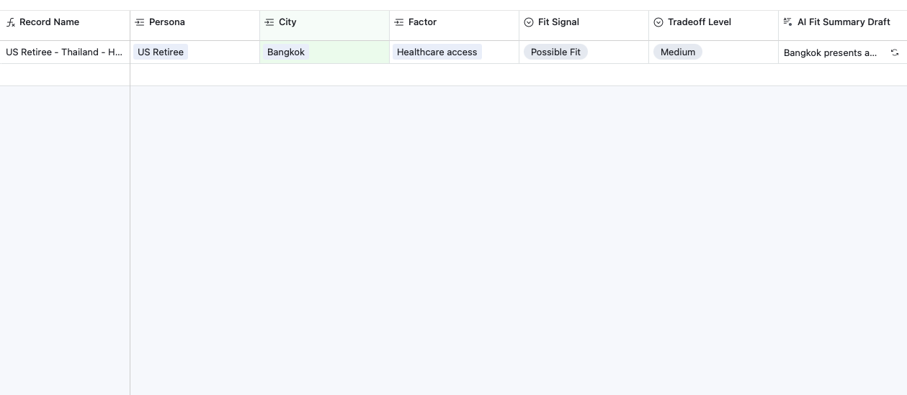

# Airtable Relocation Fit Matrix - Relocation Roadmaps

## Overview

This project shows an Airtable decision-support system built for Relocation Roadmaps.

The system helps compare relocation fit across countries, cities, personas, and decision factors. It gives relocators a clearer way to review tradeoffs, must-check issues, and evidence-backed fit signals before they make a decision.

It is not a recommendation engine. It does not rank countries or cities. It does not assign final scores. It does not tell someone where to move.

The point is simpler: organize the decision context so a person can compare options without losing track of what matters.

## What This Project Shows

This Airtable build demonstrates practical AI operations work, structured data design, and human review.

It includes:

- Relational Airtable table design
- Persona-based decision context
- Country and city fit comparison
- Linked evidence notes
- Lookup fields for cleaner AI inputs
- Airtable AI field agents for draft decision-support language
- Filtered review views
- A simple Airtable Interface for portfolio review

## System Purpose

Relocation decisions are hard because every person is optimizing for something different.

A US retiree may care most about healthcare access, visa requirements, insurance coverage, and prescription availability. A digital nomad may care more about internet reliability, visa flexibility, work environment, and cost of living.

This system gives those differences a structure.

It connects:

- Personas
- Countries
- Cities
- Fit factors
- Fit signals
- Tradeoff levels
- Evidence notes
- AI-generated draft summaries

## MVP Scope

This is an MVP portfolio build.

Included:

- Countries: Thailand, Spain, Canada
- Thailand cities: Bangkok, Chiang Mai, Phuket, Hua Hin, Pattaya/Jomtien
- Seven relocation personas
- Fit matrix notes
- Evidence support
- Airtable AI draft fields
- Review views
- Demo Interface

Not included yet:

- Spain city records
- Canada city records
- Public launch workflow
- Recommendation scoring
- Ranking logic
- Automated publishing workflow

## Personas

The system supports seven relocation personas:

- Investor and Golden Visa Buyer
- US Retiree
- Family Moving Abroad
- Moving Abroad with Pet(s)
- Digital Nomad (Remote Professional)
- Commonwealth Mover (UK, Canada, Australia)
- General Relocation

Each persona includes decision context such as:

- Primary decision need
- Main tradeoffs
- Persona description
- Decision trigger
- Key tradeoffs

These persona fields are pulled into the fit matrix through lookup fields. That keeps the source context in one place and gives Airtable AI cleaner inputs to work from.

## Core Tables

The Airtable base uses these main tables:

- Personas
- Countries
- Cities
- Fit Factors
- Fit Matrix Notes
- Evidence Notes

## Table Relationship Diagram

The system uses linked records and lookup fields to connect relocation decision context with evidence and AI-generated draft language.

  

 

## Fit Matrix Notes

The Fit Matrix Notes table is the main working table.

Each record represents one relocation fit note. A typical record combines:

- Persona
- Country
- City
- Fit factor
- Fit signal
- Tradeoff level
- Evidence
- AI draft outputs

Example test record:

- Persona: US Retiree
- Country: Thailand
- City: Bangkok
- Factor: Healthcare access
- Fit Signal: Possible Fit
- Tradeoff Level: Medium

## AI Draft Fields

Airtable AI field agents generate draft decision-support language.

The AI fields include:

- AI Fit Summary Draft
- AI Best For Draft
- AI Bad Fit If Draft
- AI Must Verify Draft
- AI Confidence

The word "Draft" matters. AI output is not treated as final copy. It still needs human review before it is used in a guide, portfolio explanation, or public-facing material.

The AI rules are intentionally narrow:

- Do not recommend a best country or city.
- Do not rank options.
- Do not make final relocation judgments.
- Generate decision-support language only.
- The relocator makes the final decision.

## Airtable Interface Demo

The Airtable Interface gives reviewers a cleaner way to inspect the system.

It shows one record at a time, with the key decision fields and AI draft outputs visible.

  

 

## Filtered Matrix View

The backend table view shows the structured matrix behind the Interface.

This view is filtered to Thailand city-level records and shows the main fields needed to review fit signals and AI draft output.

  

 

## Review Views Created

The Airtable base includes filtered views for different review tasks.

### Thailand City Fit Matrix

Shows Thailand city-level fit matrix records.

Used to compare persona, city, factor, fit signal, tradeoff level, and AI draft summary.

### Evidence Review Queue

Shows records missing supporting evidence.

Used to find records that need evidence before they can be trusted.

### Ready for Portfolio Review

Shows records where supporting evidence and the core AI draft outputs are populated.

Used to identify records that are ready for human review and portfolio screenshots.

### By Persona Review

Groups records by persona.

Used to compare how different relocation factors apply to each relocator type.

## Why This Is Useful

This project shows how Airtable can be used as more than a spreadsheet.

It combines:

- Relational data
- Human review
- Evidence tracking
- AI-assisted writing
- Controlled decision support
- Portfolio-ready Interfaces

The result is a practical system for organizing complex relocation research without turning it into a black-box scoring tool.

## Technologies Used

- Airtable
- Airtable Interfaces
- Airtable AI field agents
- Linked records
- Lookup fields
- Single select fields
- Filtered views
- Relational table design
- Human-in-the-loop AI review

## Status

MVP complete.

The core system is working with a Thailand city-level test record, AI draft outputs, evidence support, filtered views, and a demo Interface.

Future expansion could add Spain and Canada city records, more evidence notes, additional fit factors, and reviewer workflows.
