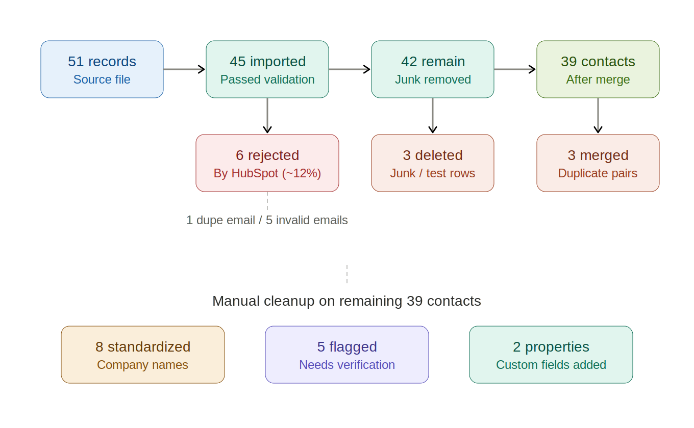
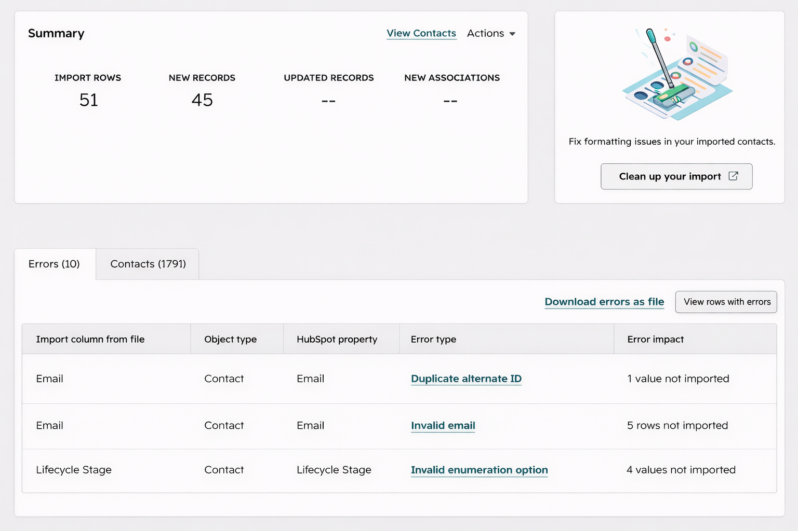
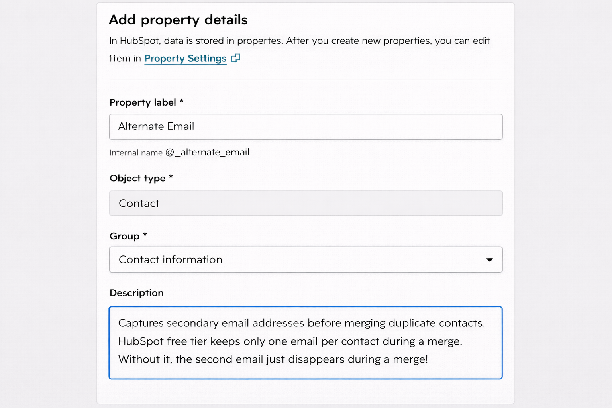
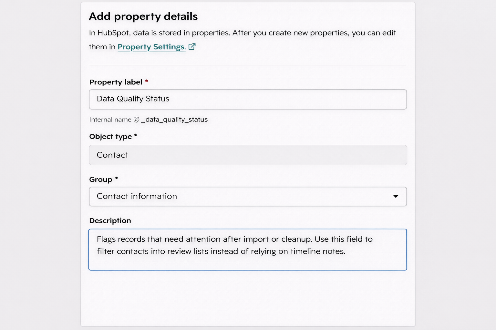

# HubSpot CRM Data Cleanup Case Study

Imported a messy contact dataset into HubSpot Free CRM, cleaned and standardized records, documented free-tier limits, and built a workaround to keep secondary emails during merges.

**Exercise:** Imported a 51-contact test dataset into HubSpot Free CRM and cleaned it up using only free-tier features. The dataset had duplicates, bad formatting, invalid emails, typo domains, missing fields, and junk rows.

## The numbers

- Source file: 51 records
- Rejected at import: 6 rows (~12%)
  - 1 duplicate email
  - 5 invalid email formats
- Imported with dropped values: 6 Lifecycle Stage values silently removed (didn't match HubSpot's allowed options)
- Imported: 45
- Junk rows deleted: 3
- Duplicates merged: 3 (Jane Doe, John Smith, Walter White)
- Company names standardized: 8 (IBM x4, Northwind x4)
- Records flagged for verification: 5
- Custom properties created: 2 (Alternate Email, Data Quality Status)
- Emails recovered from merge history: 1

## What HubSpot handled on its own

- Rejected malformed emails at import. No @, spaces in the address, [at] syntax, all blocked.
- Rejected shorthand Lifecycle Stage values. "MQL" and "SQL" don't match the enum. They got dropped.
- Trimmed leading and trailing whitespace on text fields automatically.
- Auto-associated contacts to a single Company record by email domain. The contact-level "Company Name" field was a mess ("IBM", "I.B.M.", "International Business Machines"), but all four contacts still rolled up to one IBM company record because they shared @ibm.com.

## What I had to do by hand

- **Duplicates with different email casing.** HubSpot's import dedupe is a literal string match. `john.smith@acme.com` and `John.Smith@ACME.com` came through as two separate contacts.
- **Duplicates with different email addresses entirely.** Walt White had two records with different aliases at the same company. A person can tell they're the same guy. The platform can't.
- **Contact-level Company Name cleanup.** The Company object was fine. The text field on each contact was not, and it shows up in list views and exports.
- **Typo email domains** like wayen.com and dailyplannet.com. Technically valid format, so HubSpot accepted them.
- **Junk rows with valid-looking data.** Mickey Mouse, `test@test.com.` No automated check is going to catch those.
- **Records with missing essentials.** No email, no name. They imported. They're useless.

## Key findings

**1. Bulk deduplication is paywalled.**

HubSpot's "Manage Duplicates" tool is gated behind Starter tier ($20/month and up). On free tier, you sort the contact list, eyeball for repeats, and merge pairs one at a time. Manual merge itself is free. The "find all dupes for me" button is not.

**2. Merging duplicates with different emails silently loses data.**

HubSpot treats email as the primary identifier and keeps exactly one email per contact on the free tier. When I merged Walt White's two records, the non-primary email just disappeared without warning.

Paid tiers have an "Additional Emails" property that handles this. Free tier does not.

The workaround I built: a custom Alternate Email property (Email field type) and a step before the merge: copy the losing email into the primary record's Alternate Email field before confirming the merge. For the Walt White record I already merged, I pulled the lost email back out of HubSpot's merge history and entered it into the new field.

**3. Company matching is smarter than Company Name cleanup suggests.**

HubSpot associates contacts to Company records by email domain, not by the Company Name. So the "IBM / I.B.M. / Ibm Corp / International Business Machines" mess at the contact level doesn't actually break reporting. But it's still worth cleaning because it shows up everywhere. But it's a cosmetic problem, not a technical one.

**4. A pre-import validation pass would save recoverable records.**

Of the 5 invalid-email rows HubSpot rejected, 4 were clearly junk (`test@test.com,` asdf, etc.). One (Priya Patel, priya@) looked like a real person with a truncated email, the kind of row you'd want to flag for follow-up with the source rather than silently drop. HubSpot gives you no way to distinguish the two at import time.

## Properties I added

- **Alternate Email** (custom property, Email type). Captures secondary emails that would otherwise vanish during a merge.

- **Data Quality Status** (custom property, dropdown). Values: Clean, Needs Verification, Incomplete, Do Not Contact. Turns one-off notes into a filterable field, so flagged records can be pulled into a review list later instead of rotting in timeline comments nobody reads.

## Bottom line

HubSpot Free catches the obvious stuff at import and leaves the judgment calls to you. Small teams can get by with custom properties. For more than a few hundred contacts, Starter tier is recommended.
