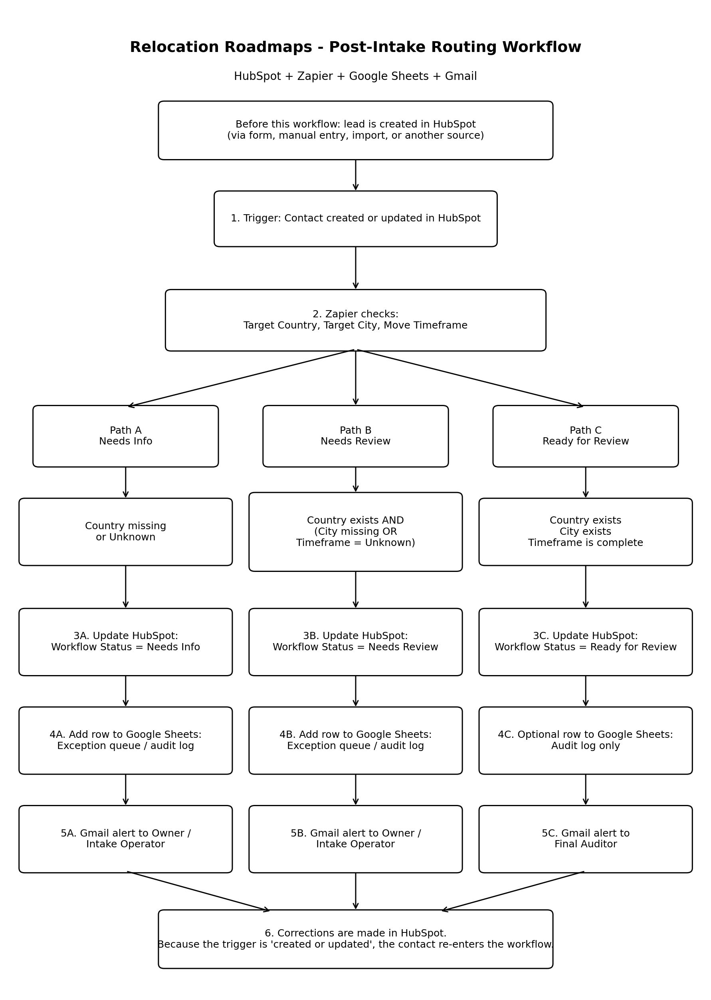
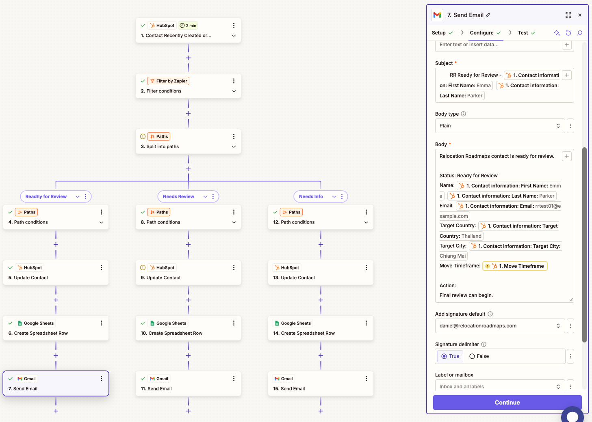
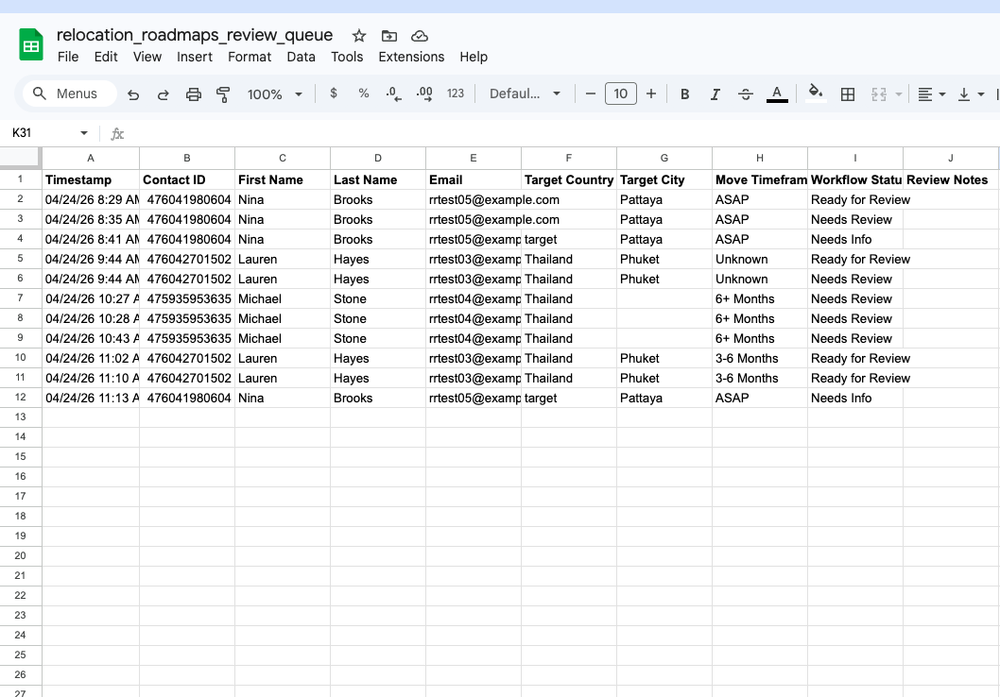
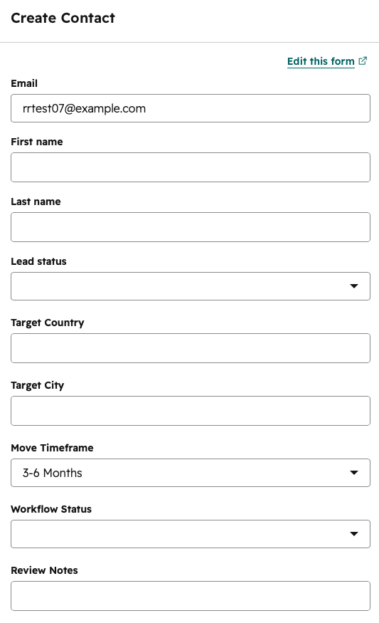
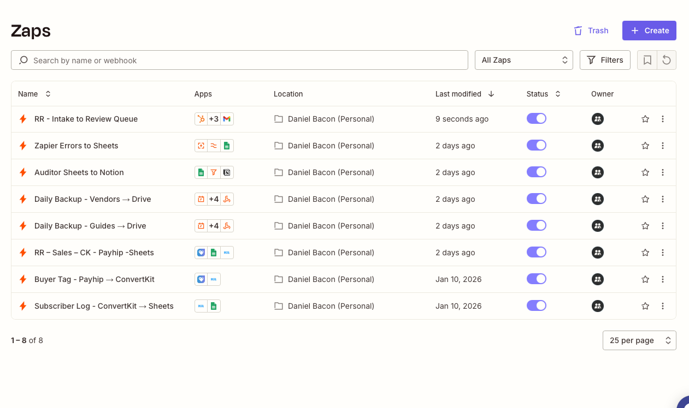

# HubSpot Intake Routing Workflow

## Technologies Used

- **Business platforms:** HubSpot, Zapier, Google Sheets, Gmail
- **Data/file formats:** Markdown
- **Version control:** GitHub

## Overview

This workflow handles post-intake contact routing for Relocation Roadmaps, an active relocation lead generation system with 3,500+ contacts across five target markets.

HubSpot stays as the source of truth. Zapier runs the routing logic. Google Sheets keeps the review queue and audit log. Gmail sends the internal alerts.

The workflow checks whether a contact has enough relocation intake information to move forward, then assigns one of three review statuses:

- `Needs Info`
- `Needs Review`
- `Ready for Review`

## Visual Workflow

## System Screenshots

### Zapier Routing Workflow

Shows the Zapier paths that route contacts based on intake completeness.

### Google Sheets Review Queue

Shows the Google Sheets queue created by the workflow.

### HubSpot Contact Fields

Shows the HubSpot fields used to collect and review intake details.

### Zapier Workflow List

Shows this workflow alongside other active operational Zaps.

## Full Workflow Spec

The full routing logic and build notes are documented here:

[View the workflow spec](Screenshots/rr-review-queue-workflow-spec.md)

## What It Does

The workflow runs when a HubSpot contact is created or updated.

It checks three intake fields:

- `Target Country`
- `Target City`
- `Move Timeframe`

Then it does four things:

- Assigns a routing status
- Updates `Workflow Status` in HubSpot
- Adds a row to Google Sheets
- Sends an internal Gmail alert

## Routing Rules

### Needs Info

A contact is routed to `Needs Info` when:

- `Target Country` is missing
- or `Target Country` is `Unknown`

### Needs Review

A contact is routed to `Needs Review` when:

- `Target Country` exists
- and `Target City` is missing
- or `Move Timeframe` is missing
- or `Move Timeframe` is `Unknown`

### Ready for Review

A contact is routed to `Ready for Review` when:

- `Target Country` exists
- `Target City` exists
- `Move Timeframe` exists
- `Move Timeframe` is not `Unknown`

## Source of Truth

HubSpot is the source of truth.

Corrections happen in HubSpot, not in Google Sheets. The spreadsheet is only a log and working review queue.

That keeps the system clean. HubSpot holds the contact record, while Google Sheets gives the operator a simple place to review what happened.

## Re-Entry Protection

The trigger runs when a contact is created or updated, so the Zap needs a guardrail.

A filter stops contacts from re-entering the workflow after they already have one of the final routing statuses:

- `Needs Info`
- `Needs Review`
- `Ready for Review`

To test a contact again, the operator can clear `Workflow Status` in HubSpot and update the record.

## Why This Matters

This workflow turns messy intake data into a clear review queue.

Instead of checking every new contact by hand, the system separates contacts into three practical groups:

- Missing key information
- Usable but incomplete
- Ready for final review

That gives the operator a cleaner handoff and keeps the main record inside HubSpot.

## Current Outcome

The workflow has been tested successfully across all three paths:

- `Needs Info`
- `Needs Review`
- `Ready for Review`

It updates HubSpot, writes to Google Sheets, and sends Gmail alerts.

## My Role

I designed and built the workflow logic, HubSpot fields, Zapier routing paths, Google Sheets review queue, Gmail alerts, and documentation.

This work combines CRM operations, automation design, intake triage, workflow testing, and practical business systems implementation.
