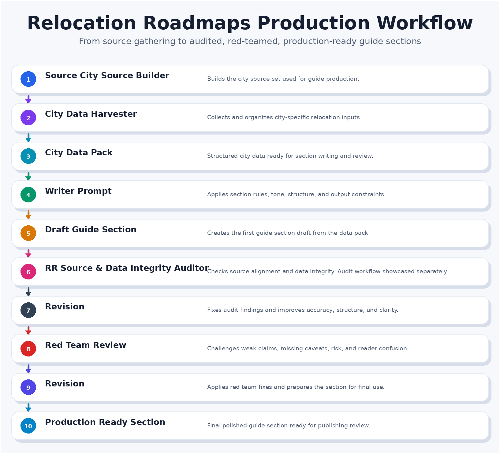
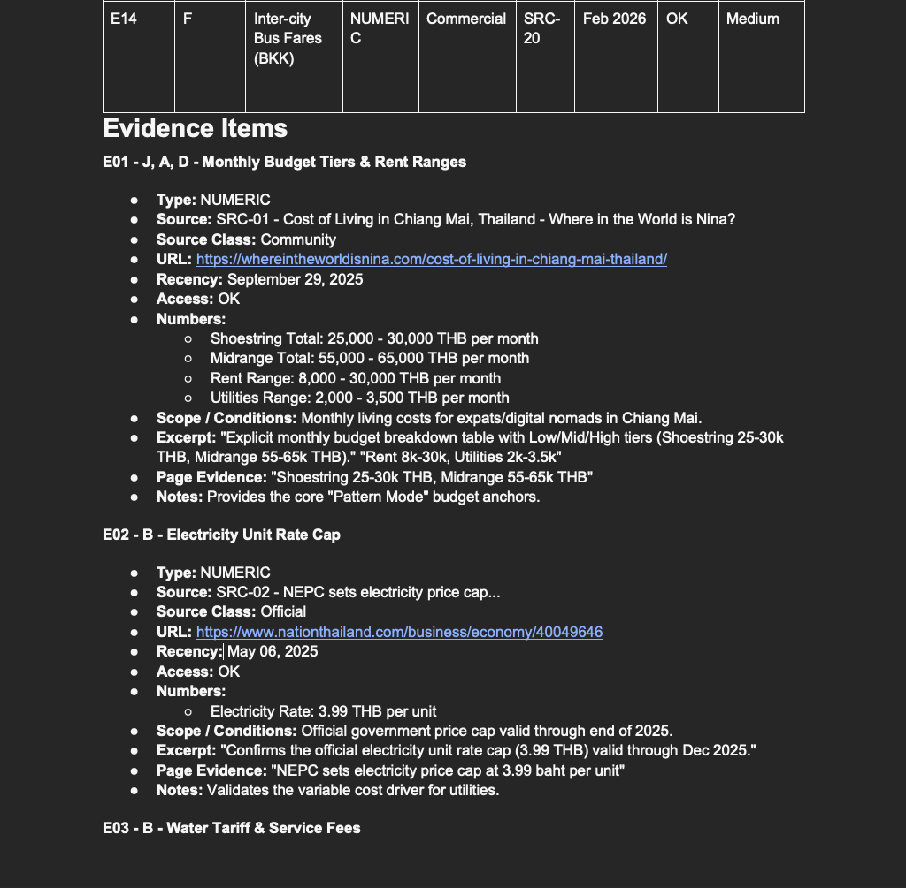

# Relocation Roadmaps - AI-Assisted Relocation Guide Production System

## Technologies Used

- **AI tools:** ChatGPT, Claude, Gemini
- **Business platforms:** Google Workspace, Google Docs, Google Sheets, Microsoft Excel, Notion, Zapier, HubSpot, WordPress
- **Data/file formats:** JSON, TSV, Markdown
- **Version control:** GitHub

Relocation Roadmaps is a structured content production system for creating relocation and retirement guides with AI-assisted writing, human review, data auditing, and reusable production workflows.

I built this system to turn country, city, visa, healthcare, housing, finance, and lifestyle research into guide sections that are clear, consistent, source-aware, and ready for review.

## Featured Artifacts

### 1. Guide Cover Sample

The guide cover makes the project visible as a real product, not just an internal workflow or documentation exercise.

  

### 2. Production Workflow

The workflow shows how raw research moves through structured data gathering, guide production, QA review, audit passes, and final publishing decisions.

  

### 3. Production-Ready Guide Section Sample

This sample shows a completed guide section after structured drafting, editing, and review. The Section 07 budget sample shows how the system handles monthly cost bands, numeric anchors, source-aware claims, and reader-facing guidance.

  

### 4. Evidence Ledger Sample

The evidence ledger shows how source material is organized before it is used in guide production. It tracks source type, source class, recency, access status, numeric anchors, page evidence, and notes, so the writing process has a clear evidence base.

  

### 5. AI Guide Audit Workflow

A separate work sample shows the data auditor workflow used to review AI-generated guide content against structured source material.

[View the AI Guide Audit Workflow](https://github.com/dbfl2026/db-work-samples/tree/main/Systems/AI-Guide-Audit-Workflow)

### 6. Source & Data Integrity Auditor

The custom auditor reviews guides, tables, and source lists before publishing. It flags missing information, source gaps, outdated claims, citation problems, internal inconsistencies, and risk areas without rewriting the content.

  

### 7. Fact Checker & Red Team Auditor

The fact checker and red team auditor is designed to protect the reader from financial loss, legal rejection, logistical failure, or misleading claims caused by outdated, incorrect, vague, or non-executable information.

  

## What This Project Shows

This project shows practical AI operations work across content production, prompt design, quality control, structured review, and workflow documentation.

It includes examples of:

- AI-assisted guide section production
- Custom writer prompts and review prompts
- Red team review for quality, consistency, and risk
- Structured data pack and evidence ledger usage
- Repeatable QA and audit workflows
- Production-ready guide section samples
- Human-in-the-loop editing and final review

## Why It Matters

Relocation content is hard to get right. It combines personal decision-making with information that changes often, including visas, healthcare access, tax exposure, banking, housing, residency rules, and local quality of life.

This system is not built to generate generic AI travel content. It is built to control the production process. AI helps organize, draft, review, and improve the material, but humans stay responsible for judgment, accuracy, and final publishing decisions.

## System Overview

The Relocation Roadmaps workflow uses a modular production process:

1. Build or update the country and city data pack
2. Generate guide sections using structured writer prompts
3. Run QA checks against formatting, tone, structure, and source expectations
4. Red team sections for unclear claims, weak logic, missing context, or reader risk
5. Revise into production-ready guide copy
6. Maintain reusable prompts, examples, and section rules for future guides

## My Role

I designed and built the production system, including the workflow structure, prompt architecture, quality review process, sample guide outputs, and supporting documentation.

The work combines product thinking, content operations, AI workflow design, prompt engineering, editorial judgment, and practical automation planning.

## Key Takeaway

Relocation Roadmaps shows AI being used inside a controlled production system, not as a one-click content generator.

The value is in the workflow: structured inputs, reusable prompts, review layers, risk checks, and production standards that make the output more consistent and trustworthy over time.
