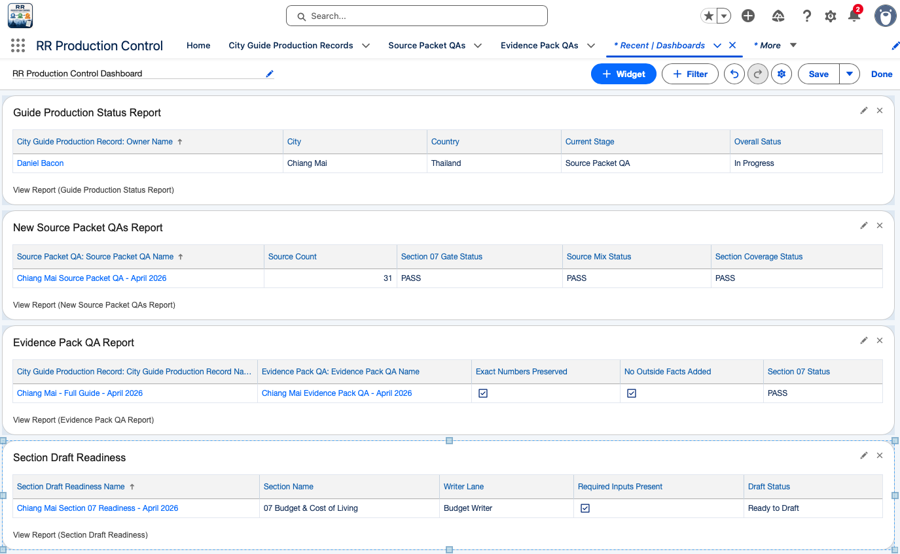
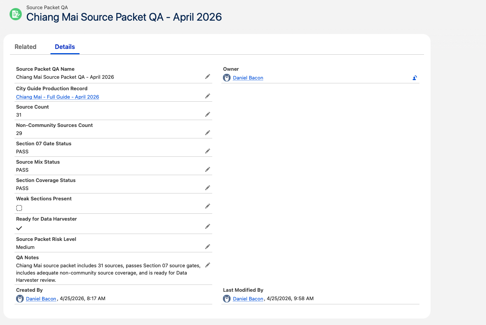
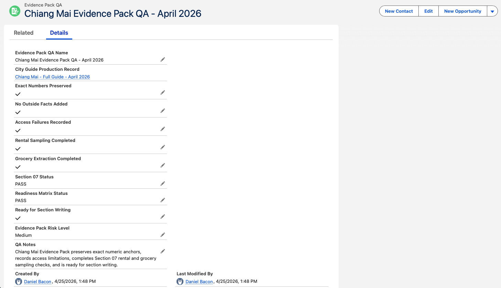

# Salesforce Production Control Workflow - Relocation Roadmaps

## Overview

This project shows a Salesforce workflow built for a real Relocation Roadmaps production process.

The sample workflow uses the Chiang Mai guide for the Thailand Relocation Guide. This is not a fake sales pipeline. It is a small Salesforce control system for tracking source review, evidence review, and section writing readiness in an AI-assisted publishing process.

## Business Problem

Relocation Roadmaps uses a structured production process with several handoffs.

1. The Source Builder creates a city-specific Source Packet.
2. The Data Harvester turns approved sources into an Evidence Pack.
3. The Section Writer drafts from approved evidence only.
4. QA checks confirm that source rules, evidence rules, number handling, and writing rules are followed before publishing.

That process needs control points. Without them, it is too easy for weak sources, missing evidence, unsupported numbers, or unclear handoffs to slip through.

## Salesforce Solution

I built a small Salesforce app called **RR Production Control** to track the workflow from guide-level status through source QA, evidence QA, and section-level writing readiness.

The Salesforce build includes:

- Custom app
- Parent object for each city guide production run
- Child QA objects tied to the parent guide record
- Custom fields for readiness checks, gate status, risk level, and QA notes
- List views for operational tracking
- Reports and dashboard for production visibility

## Workflow Model

City Guide Production Record

- Source Packet QA
- Evidence Pack QA
- Section Draft Readiness

## Custom Objects

## City Guide Production Record

Represents one complete city guide production run.

Example record:

`Chiang Mai - Full Guide - April 2026`

Key fields:

- City
- Country
- Product
- City ID
- Guide Type
- Current Stage
- Overall Status
- Risk Level
- Ready for Next Step

## Source Packet QA

Tracks whether the Source Builder output is ready for the Data Harvester.

Key fields:

- Source Count
- Non-Community Sources Count
- Section 07 Gate Status
- Source Mix Status
- Section Coverage Status
- Weak Sections Present
- Ready for Data Harvester
- Source Packet Risk Level
- QA Notes

## Evidence Pack QA

Tracks whether the Evidence Pack follows the Data Harvester rules.

Key fields:

- Exact Numbers Preserved
- No Outside Facts Added
- Access Failures Recorded
- Rental Sampling Completed
- Grocery Extraction Completed
- Section 07 Status
- Readiness Matrix Status
- Ready for Section Writing
- Evidence Pack Risk Level
- QA Notes

## Section Draft Readiness

Tracks whether an individual guide section is ready for writing.

Example record:

`Chiang Mai Section 07 Readiness - April 2026`

Key fields:

- Section Name
- Writer Lane
- Required Inputs Present
- Draft Status
- QA Status
- Unsupported Claims Found
- Source IDs Removed
- Publish Ready
- QA Notes

## Why Section 07 Was Used

Section 07 - Budget & Cost of Living was used as the sample section because it has the strictest evidence requirements.

This section has to handle:

- Exact numbers
- Cost anchors
- Monthly totals
- Rental sampling
- Grocery extraction
- Source reliability
- Unsupported assumptions

That makes it a good Salesforce test. A simple status field would not be enough. The workflow needs real gates.

## Screenshots

## 01 - RR Production Control Dashboard

Shows the Salesforce dashboard with guide status, Source Packet QA, Evidence Pack QA, and Section Draft Readiness in one control view.

## 02 - Active Guide Production Records

Shows the active guide production list view with the Chiang Mai guide record, current stage, overall status, readiness, and risk level.

## 03 - City Guide Production Record - Related Records

Shows the Chiang Mai parent guide record with its related child records: Source Packet QA, Evidence Pack QA, and Section Draft Readiness.

## 04 - Source Packet QA - Custom Fields

Shows the custom fields created for the Source Packet QA object, including source count, Section 07 gate status, source mix status, Data Harvester readiness, and QA notes.

## 05 - Chiang Mai Source Packet QA - April 2026

Shows the completed Source Packet QA record for Chiang Mai, including source count, Section 07 gate status, source mix status, section coverage status, and readiness for Data Harvester.

## 06 - Chiang Mai Evidence Pack QA - April 2026

Shows the completed Evidence Pack QA record, including exact-number preservation, outside-fact control, access failure tracking, sampling checks, and readiness for section writing.

## 07 - Chiang Mai Section 07 Readiness - April 2026

Shows the section-level readiness record for Chiang Mai Section 07 - Budget & Cost of Living.

## What This Shows

This project shows practical Salesforce Admin work in a real operations context.

Skills shown:

- Custom app setup
- Custom object creation
- Parent-child object relationships
- Custom fields and picklists
- Page layouts
- List views
- Reports
- Dashboard setup
- Workflow and status design
- QA and handoff tracking
- Production control for AI-assisted content workflows

## Why This Matters

Salesforce is usually shown as a sales pipeline tool. This project uses it differently.

Here, Salesforce acts as a production control system for an AI-assisted publishing workflow. It tracks whether each stage is ready before the next person or process starts work.

That matters because AI-assisted work still needs human review, source control, evidence discipline, and clear handoff rules.

## Status

Portfolio work sample complete.

This is a working Salesforce configuration built from the Chiang Mai guide production process.
