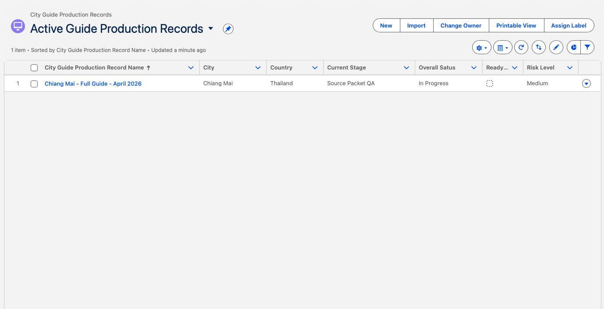
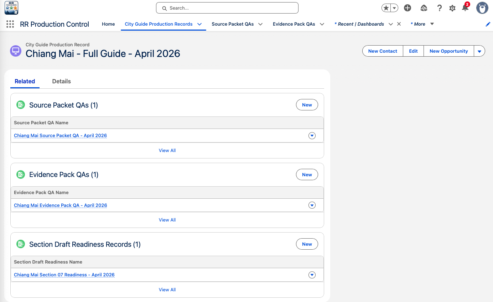
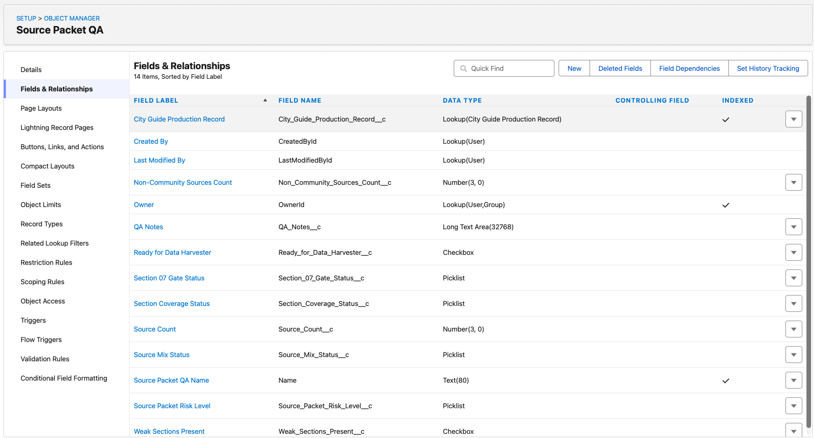
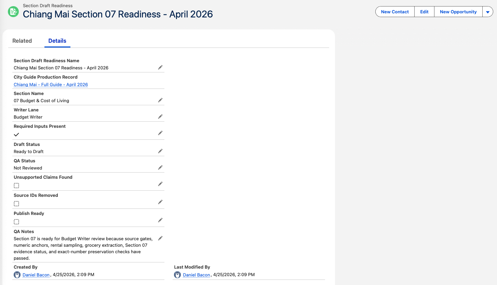

# Salesforce Production Control Workflow - Relocation Roadmaps

## Overview

This project is a Salesforce workflow built for a real Relocation Roadmaps guide production process.

It uses the Chiang Mai guide for the Thailand Relocation Guide as the sample record. This is not a fake sales pipeline or generic demo. It is a small production control system for tracking source review, evidence review, and section writing readiness in an AI-assisted publishing workflow.

The goal is simple: make sure guide production does not move forward until the right QA gates are cleared.

## Business Problem

Relocation Roadmaps uses a structured content production process with several handoffs:

1. Source Builder creates a city-specific Source Packet.
2. Source Packet QA confirms the source set is usable.
3. Data Harvester creates an Evidence Pack from approved sources only.
4. Evidence Pack QA confirms the evidence follows production rules.
5. Section Writer drafts from approved evidence only.
6. Final QA checks readiness before publishing.

Without a control layer, weak sources, missing evidence, unsupported numbers, and unclear handoffs can move downstream too easily.

## Salesforce Solution

I built a small Salesforce app called **RR Production Control** to track the guide workflow from source review through evidence review and section-level writing readiness.

The build includes:

- Custom Salesforce app
- Parent object for each city guide production run
- Child QA objects for source review, evidence review, and section readiness
- Custom fields for readiness checks, gate status, risk level, blockers, and QA notes
- List views for active production tracking
- Reports and dashboard for workflow visibility

## Operating Model

Drive remains the source of truth for the actual production files:

- Source Packets
- Evidence Packs
- Drafts
- Final guide files

Salesforce does not store the guide content itself. It tracks production status, QA gates, blockers, and handoff readiness.

Day to day, the workflow would work like this:

1. A city guide production record is created in Salesforce.
2. Source Packet QA is completed after the Source Builder finishes the source file.
3. Evidence Pack QA is completed after the Data Harvester finishes the evidence file.
4. Section Draft Readiness records confirm whether individual sections are ready for writing.
5. Reports and dashboards show which guide work is ready, blocked, high risk, or waiting for review.

This keeps the workflow controlled without turning Salesforce into a content storage system.

## Workflow Model

City Guide Production Record

- Source Packet QA
- Evidence Pack QA
- Section Draft Readiness

Example parent record:

`Chiang Mai - Full Guide - April 2026`

Example section readiness record:

`Chiang Mai Section 07 Readiness - April 2026`

## Why Section 07 Was Used

Section 07 - Budget & Cost of Living was used as the sample section because it has the strictest evidence requirements.

This section has to control:

- Exact numbers
- Cost anchors
- Monthly totals
- Rental sampling
- Grocery extraction
- Source reliability
- Unsupported assumptions

That makes it a strong test case. A simple status field would not be enough. The workflow needs real QA gates before drafting begins.

## Current Build vs Future Automation

The current version is intentionally manual and portfolio-sized.

That is appropriate for the current stage. The important work is defining the control points, status fields, QA gates, and handoff structure.

A realistic next automation layer could include:

- Auto-create standard QA child records when a new city guide production record is created
- Update parent guide status when source QA or evidence QA is approved
- Create follow-up tasks when a record is blocked
- Flag high-risk guide records on the dashboard
- Send handoff notifications when a stage becomes ready

The key principle: automate routing, reminders, and status updates, but keep QA judgment human-owned.

## Screenshots

### 01 - RR Production Control Dashboard

Dashboard view showing guide status, Source Packet QA, Evidence Pack QA, and Section Draft Readiness.

### 02 - Active Guide Production Records

List view showing active guide production records, current stage, overall status, readiness, and risk level.

### 03 - City Guide Production Record - Related Records

Parent guide record with related Source Packet QA, Evidence Pack QA, and Section Draft Readiness records.

### 04 - Source Packet QA - Custom Fields

Custom fields for source count, Section 07 gate status, source mix status, Data Harvester readiness, and QA notes.

### 05 - Chiang Mai Source Packet QA - April 2026

Completed Source Packet QA record showing source readiness checks.

### 06 - Chiang Mai Evidence Pack QA - April 2026

Completed Evidence Pack QA record showing evidence readiness checks.

### 07 - Chiang Mai Section 07 Readiness - April 2026

Section-level readiness record for Chiang Mai Section 07 - Budget & Cost of Living.

## What This Demonstrates

This project shows practical Salesforce Admin and operations design skills in a real workflow context:

- Custom app setup
- Custom object design
- Parent-child object relationships
- Custom fields and picklists
- Page layouts
- List views
- Reports and dashboard setup
- QA gate design
- Workflow status tracking
- Production handoff control
- AI-assisted content workflow governance

## Why This Matters

Salesforce is often shown as a sales pipeline tool. This project uses it as a production control system.

The workflow tracks whether each stage is ready before the next person or process starts work. That matters because AI-assisted production still needs source control, evidence discipline, human review, and clear handoff rules.

## Status

Portfolio work sample complete.

This is a working Salesforce configuration based on the Chiang Mai guide production process for Relocation Roadmaps.
